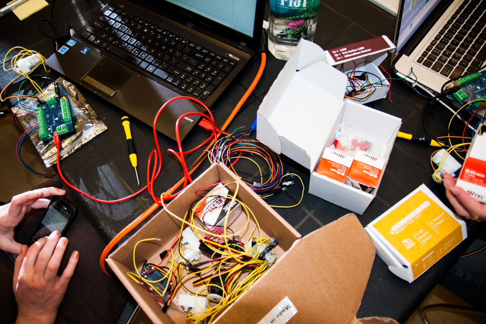

# BirdBrain Technologies: Developing Ed-Tech that Learns Alongside Students & Teachers

*Watch the video: [BirdBrain Technologies on YouTube](https://www.youtube.com/watch?v=y9or1lkwQyE)*

*BirdBrain Technologies creates affordable robotics tools that help teachers make coding and computer science accessible.*

Robotics, coding, and computer science are increasingly important to the future career prospects of today’s students. Yet classroom teachers and informal educators often face barriers in the cost of equipment and the perceived difficulty of the subject matter.

By providing flexible and affordable robotics products that are easy to use, Pittsburgh’s [BirdBrain Technologies](http://remakelearning.org/organization/birdbrain-technologies/) introduces students to programming and robotics and cultivates their ability to think and work creatively with these 21st century tools.

Founded in 2010 by [Tom Lauwers](http://remakelearning.org/person/lauwers-tom/), who had just completed a Ph.D. in Robotics at Carnegie Mellon University ([CMU](http://remakelearning.org/organization/carnegie-mellon/)), BirdBrain Technologies originated from Lauwers’ work with CMU’s Community Robotics, Education and Technology Empowerment ([CREATE](http://remakelearning.org/organization/carnegie-mellon/carnegie-mellon-school-computer-science/robotics-institute/create-lab/)) Lab, which promotes technological fluency through education.

BirdBrain’s first product was a tool to motivate computer science students by giving them a tangible representation of their coding. The [Finch](http://remakelearning.org/project/finch/) is a durable, two-wheeled plastic robot that accepts computer science commands in a number of programming languages and gives students instant visual feedback. Shortly thereafter, Lauwers designed the [Hummingbird Robotics Kit](http://remakelearning.org/resource/hummingbird/), which contains the basic components needed for a wide array of robotics, kinetics, and animatronics projects across disciplines.

The strength of educational products like Finch and Hummingbird lies in their ability to make learning something you can see and touch. For many students, these tools represent their first exposure to project-based learning. In particular, Lauwers says, “It’s about doing something as a project that requires creativity and thinking — and it probably doesn’t work the first time. Students have to do some engineering and some programming and some testing before they get it right.”

The approach fits well with the demands of the project-based workplace of the future, which will demand employees with creativity and problem-solving skills.

“I would much rather see a student write a program that makes a multiplication table and autofills it than memorize a multiplication table,” Lauwers says.

> The Finch helped me understand objects and their methods in a way that the textbook never could.
>
> — student at Franklin Regional High School

Lauwers partnered with educators in Pittsburgh-area middle schools, high schools, and community colleges to co-design and test products, integrating feedback to develop instructional resources that work both in- and out-of-school.

Supplementing these in-person collaborations are online forums where teachers post lesson plans for using BirdBrain products and share tips for engaging students.

Through these partnerships, Lauwers has built a regional “cluster” of Finch and Hummingbird users in the Pittsburgh region. It’s a strategy that has built a market for BirdBrain products and enriched the community of educators and students using the Finch and Hummingbird Kit to expand opportunities for robotics and computer science learning.

*by Adam Reger*

## By the Numbers

Nearly 20,000 BirdBrain products are in use in more than 1,000 classrooms, reaching more than 50,000 students nationwide.

In 2014, the PreK-12 education technology market had an estimated value of $7.9 billion.

## Network in Action

**Professional development brings educators together with innovators. (Convene)**

Partnerships with professional development agencies in the [Remake Learning Network](http://remakelearning.org) has been instrumental in helping BirdBrain improve its products and expand its reach.

[ASSET STEM Education](http://remakelearning.org/organization/asset/) hosts Hummingbird professional development on an almost monthly basis. The [Allegheny Intermediate Unit](http://remakelearning.org/organization/aiu/) hosts two-day training workshops in their trasnformED professional development space, a digital playground for teachers, exploring new education technology tools.

Working with the Carnegie Library of Pittsburgh ([CLP](http://remakelearning.org/organization/carnegie-library/)) has helped Lauwers adapt his products for self-directed learning in out-of-school environments. Materials like comic book-style instructional guides were originally made by CLP librarians, and now they are used by BirdBrain in all their product kits.

## Person of Interest

### Tom Lauwers

Tom Lauwers founded BirdBrain Technologies to produce tangible ed-tech products to introduce kids to computer science in creative ways.

> We focus on making the software easy to install in a school setting. And then what is the curriculum around that? Are there classroom examples that we can show teachers? What is the professional development situation like? Is there a way for a teacher to be trained? All of those additional things are part of the product. They’re not just add-ons. They are an essential part.

When Tom was working toward his Ph.D. at Carnegie Mellon’s CREATE Lab, he became interested in the potential for robotics technologies to enhance motivation and learning in science and technology education. Working with his CREATE Lab teammembers, Tom began designing robots that could adapt to a variety of educational environments. To take his research projects to scale, Tom spun-out his own startup company BirdBrain Technologies in 2010 and began partnering with school teachers and out-of-school educators to design and develop new products like the HummingBird Robotics kit that combines arts & crafts activities with introductory computer programming and hardware lessons.

To help build his customer base, and also constantly improve the products and their associated educational materials, Tom has built partnerships with professional development agencies who serve thousands of teachers, and also created online communities for teachers from across the country to share ideas for using BirdBrain products in everything from art class to engineering electives.

## More Information

If you’re interested in learning more about BirdBrain Technologies, contact [Tom Lauwers](http://remakelearning.org/person/lauwers-tom/).

### Downloadable Materials

- [**Hummingbird Curricula & Resources**](http://www.hummingbirdkit.com/teaching/resources): Teacher guides, lesson planning forms, student worksheets, and comics to support educators implement Hummingbird kits effectively.
- [**Hummingbird Duo User Guide**](https://dl.dropboxusercontent.com/u/9303915/hummingbird-duo-guide.pdf): Complete guide for using the Hummingbird Duo kit, including identifying the physical components and programming your bot.
- [**Arts & Bots Hummingbird Workshop Materials**](http://artsandbots.posthaven.com/arts-and-bots-workshop-materials-updated): Workshop presentation and reference sheet for using the hummingbird kit.
- [**Arts & Bots Full Hummingbird Curriculum**](http://artsandbots.posthaven.com/full-curriculum): Curricula used by Arts & Bots for teaching language art, science, art, technology, math, social studies, biology, and anatomy.
- [**Hummingbird Comic—Connecting Electronics**](https://dl.dropboxusercontent.com/u/9303915/Connecting%20Electronics2.3.15.pdf): Comic-style presentation of the connections and electronic components of the Hummingbird kit.
- [**Hummingbird Comic—Building Your First Bot**](https://dl.dropboxusercontent.com/u/9303915/Build%20Your%20First%20Bot.pdf): Comic-style presentation of steps for building a simple robot using the Hummingbird kit.
- [**Hummingbird Comic—CREATELab Visual Programmer**](https://dl.dropboxusercontent.com/u/9303915/Create%20Lab%20Visual%20Programmer.pdf): Comic-style presentation for using the CREATELab Visual Programmer.
- [**Hummingbird Grant Writing Assistance**](http://www.hummingbirdkit.com/buy/grant-assistance): A collection of tools and resources, including application templates, for requesting funding to support the use of Hummingbird Kits.
- [**Finch Grant Writing Assistance**](http://www.finchrobot.com/grant-writing-materials): A collection of tools and resources, including application templates, for requesting funding to support the use of the Finch.

### Online Resources

- [**Finch Robot Loan Program**](http://www.finchrobot.com/loan-program/main): A program that loans out six sets of 40 Finch robots monthly during the school year, so that young coders across the country can have access to the Finch.
- [**Finch Assignments**](http://www.finchrobot.com/assignments): Collected assignments and activities that allow educators to get up and running with the Finch quickly—organized by the concept being illustrated.
- [**Hummingbird Community**](http://www.hummingbirdkit.com/community): Forums, classroom-tested projects, and other resources for teaching with the Hummingbird kit; for educators, by educators.
- [**Hummingbird Virtual Training Workshop**](http://www.hummingbirdkit.com/learning/training/virtual-workshop): A collection of 8 videos that serve as a virtual workshop to get educators up and running with the Hummingbird kit.
- [**Hummingbird Tutorials**](http://www.hummingbirdkit.com/learning/tutorials/): Tutorials for building and programming robots of various complexity.
- [**Educational Robotics for the Classroom**](http://artsandbots.posthaven.com/pages/educational-products-for-the-classroom): Educational partners and course materials for Hummingbird educator workshops.

### Related Projects & Partners

- [**Zulama**](http://zulama.com/): An educational technology company that develops systems and tools that blend technology and creativity for educators and students.
- [**Romibo**](http://origamirobotics.com/): An interactive robot developed to assist with autism therapy and language learning by telling stories and delivering prompts and praise.
- [**Carnegie Mellon’s Robotics Academy**](http://education.rec.ri.cmu.edu/): A research organization with CMU’s School of Computer Science that studies how teachers use robots in classrooms to teach CS-STEM.
- [**Schell Games**](http://www.schellgames.com/): A game design and development company that specializes in creating interactive educational games.
- [**Little Bird Games**](http://littlebirdgames.com/): An educational and therapeutic video, board, and card game design company.

---

*Add your comments and feedback about this case on [Medium](https://medium.com/remake-learning-case-studies/developing-ed-tech-that-learns-alongside-students-teachers-732d78ba6f2c).*
