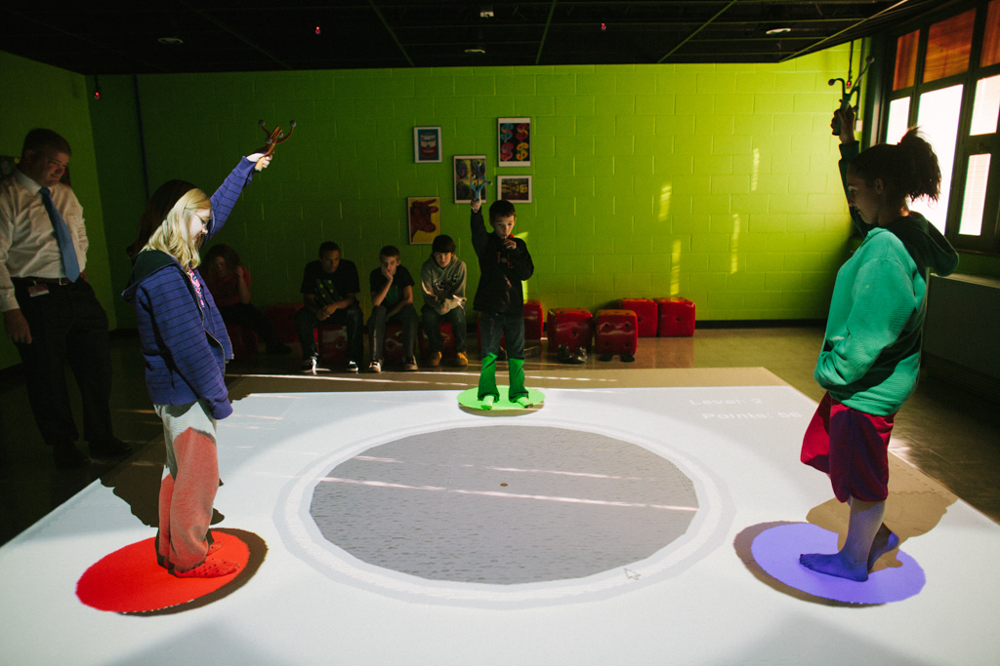
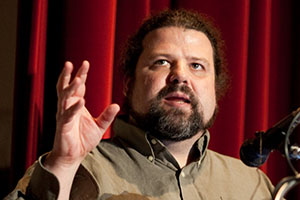
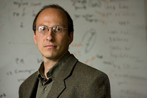

# Carnegie Mellon University: Bridging the Community & Higher Education

*Watch the video: [Carnegie Mellon University on YouTube](https://www.youtube.com/watch?v=LNjFVkj6_dg)*

*Carnegie Mellon’s CREATE Lab and the Entertainment Technology Center are connecting university students and researchers to the communities they serve.*

Universities are engines of exploration, discovery, and innovation. Still, too often, research universities with deep wells of intellectual capital miss opportunities to deliver meaningful solutions to the communities around them. When educators and community members are able to tap into these extraordinary resources, students gain exposure to some of today’s most cutting edge technologies.

That’s why Carnegie Mellon University ( [CMU](https://remakelearning.org/organization/carnegie-mellon/)), one of the most highly regarded private research universities in the world, has connected with a network of regional educators to co-develop innovative, effective education solutions that work in the Pittsburgh region.

The Community Robotics, Education, and Technology Empowerment ( [CREATE](https://web.archive.org/web/20150916042817/http://remakelearning.org/organization/carnegie-mellon/carnegie-mellon-school-computer-science/robotics-institute/create-lab/)) Lab and the Entertainment Technology Center ( [ETC](https://web.archive.org/web/20150916063114/http://remakelearning.org/organization/carnegie-mellon/etc/)) are two examples of CMU’s commitment to putting innovation to work in the Pittsburgh region.

> Ideas and inspirations for the way the world should be and how we can design the future with technology is sourced from the communities and the people and the experiences we have.
>
> — [Marti Louw](https://remakelearning.org/person/louw-marti/), Director, Learning Media Design Center, Carnegie Mellon University

Established in 1997 by roboticist [Illah Nourbakhsh](https://remakelearning.org/person/nourbakhsh-illah/), the CREATE Lab explores socially meaningful innovation and deploys robotic technologies to address community challenges ranging from air pollution to the achievement gap.

“The CREATE Lab was born out of a desire to change the way the university relates to its community,” says Nourbakhsh. “If we start with education, we can empower students to think about technology as a tool that they can use for social change.”

By partnering with schools, museums, libraries, and child-serving organizations, researchers in the CREATE Lab develop tools and programs to empower a technologically fluent generation through experiential learning. Together with the Pittsburgh Association for the Education of Young Children ( [PAEYC](https://web.archive.org/web/20150916070154/http://remakelearning.org/organization/pittsburgh-association-for-the-education-of-young-children/)), CREATE Lab developed [Message From Me](https://web.archive.org/web/20150916150603/http://remakelearning.org/project/message-from-me/), kid-friendly kiosks that enable young children to record their daily experiences through pictures and speech and send them to their parents’ cell phones or email. Now in more than 100 early childhood classrooms throughout the Pittsburgh region, Message From Me enhances parent-child conversations and involves families in the day-to-day educational experience of their children.

To expand its impact in the region, CREATE Lab established a [Satellite Network](https://web.archive.org/web/20150916092427/http://remakelearning.org/project/create-lab-satellite-network/) in partnership with [Marshall University](https://www.marshall.edu/landing/home/index.html), [West Liberty University](https://web.archive.org/web/20151121051421/http://remakelearning.org/organization/west-liberty-university/), [Carlow University](https://web.archive.org/web/20150916053358/http://remakelearning.org/organization/carlow-university/), [West Virginia University](https://web.archive.org/web/20150916035142/http://remakelearning.org/organization/west-virginia-university/), and [Penn State New Kensington](http://www.nk.psu.edu/). These institutions connect CREATE Lab technologies with pre-service teachers who develop pedagogical uses while also offering critical user feedback on potential products. This process of iterative design ultimately produces tools that are optimized for effectiveness in a diverse array of learning environments.

Started by computer scientist Randy Pausch and drama professor [Don Marinelli](https://web.archive.org/web/20151124064532/http://remakelearning.org/person/marinelli-don/) in 1999, the ETC is a two-year graduate program offering a master’s degree in entertainment technology that combines technical courses in digital technology and game development with art courses in storytelling and design.

To earn their degree, students must work with community representatives to co-develop games for good—from schools to hospitals to museums and beyond. These partnerships often produce compelling results. In 2010, [Elizabeth Forward School District](https://remakelearning.org/organization/elizabeth-forward-school-district/) built a [SMALLab](https://web.archive.org/web/20150916084029/http://remakelearning.org/project/smallab/) (Situated Multimedia Arts Learning Laboratory), an immersive environment that uses games to enable students to learn kinesthetically. By partnering with a team of students from the ETC, educators at Elizabeth Forward created their own learning games that fit within their curriculum and appealed to students.

ETC director [Drew Davidson](https://remakelearning.org/person/davidson-drew/), a leading member of the [Remake Learning Network](https://remakelearning.org) since its earliest days, encourages students to consider the educational potential of new technology whenever possible. “We believe that all of this great entertainment technology can have positive social impact,” he says. “We’re always looking for great projects in general, but we’re also trying to do something more—to make the world a better place.”

*by Ashlee Green*

## By the Numbers

Since its inception, the CREATE Lab Satellite Network has engaged 260 teachers, 650 pre-service teachers, 7,200 students, and 90 schools.

In the last 15 years, ETC has supported over 175 community projects, including the [MAKESHOP](https://remakelearning.org/project/makeshop/) at the [Children’s Museum of Pittsburgh](https://web.archive.org/web/20150919102841/http://remakelearning.org/organization/childrens-museum/).

## Network in Action

**Lunch & Learns create opportunities to share knowledge and expertise. (Convene)**

Convening network members to learn from the thought leadership and collective expertise of higher education institutions like Carnegie Mellon helps to raise the level of awareness and understanding of new technologies among network members.

Speaking at a Remake Learning Network Lunch & Learn, CREATE Lab director Dr. Illah Nourbakhsh explored how advanced technologies are shaping a new discourse regarding the role of education in directing community change, and the role of communities in directing the future of technology innovation.

## Persons of Interest

### Drew Davidson

Drew Davidson is director of the Entertainment Technology Center at Carnegie Mellon University.

> When the network started, it seemed like a really great fit for us because we’re always looking for partners who have a design challenge. So for our educational goals, like giving a interdisciplinary team an interesting and creative design challenge for the semester, can also help a school or a museum or a library.

Drew is a professor, producer, and player of interactive media. His background spans academic, industry, and professional worlds, and he is passionate about stories and transformational experiences across texts, comics, games, and other media. At ETC, Drew is dedicated to teaching and research that both pushes the limits of interactive media and has relevance to people. In this vein, he has pushed for ETC students and faculty to engage with educators to co-develop education solutions that leverage the power of technology, gaming, and storytelling to enhance teaching and learning.

Since 2000, graduate teams at ETC have contributed to more than 175 community projects, including exemplary Remake Learning projects like MAKESHOP at the Children’s Museum of Pittsburgh and the SMALLab at Elizabeth Forward Middle School, as well as national models or learning innovation like YouMedia in Chicago.

### Illah Nourbakhsh

Illah Nourbakhsh directs the CREATE Lab at Carnegie Mellon where he oversees teams of technologists who partner with community members to make a social impact.

> CREATE Lab is fundamentally about community engagement. What we do is pick a community of practice and then work with that community of practice to understand their needs to improve the world socially and then innovating with them. So it’s what we call participatory design. It’s interesting because the whole Remake Learning Network is about participatory design.

Illah has spent his career exploring human-robot interactions with the goal of creating rich, effective, and satisfying interactions between humans and robots. Working as a professor at CMU’s Robotics Institute, Nourbakhsh leveraged his expertise in human-robot interactions to launch the CREATE Lab in 1997 to explore socially meaningful innovation and deployment of robotic technologies to address community challenges ranging from air pollution to the achievement gap.

In addition to incubating some of the most important projects to emerge from the Remake Learning Network, the CREATE Lab has established a satellite network in partnership with schools of education in Pittsburgh and nearby West Virginia, engaging 260 school teachers and 650 pre-service teachers in the creative use of technology for learning.

## More Information

If you’re interested in learning more about CREATE Lab, contact [Dror Yaron](https://web.archive.org/web/20150926114916/http://remakelearning.org/person/yaron-dror/).

If you’re interested in learning more about the Entertainment Technology Center, contact [Drew Davidson](https://remakelearning.org/person/davidson-drew/).

---

*Add your comments and feedback about this case on [Medium](https://medium.com/remake-learning-case-studies/bridging-the-community-higher-education-15dd9a85b113).*
