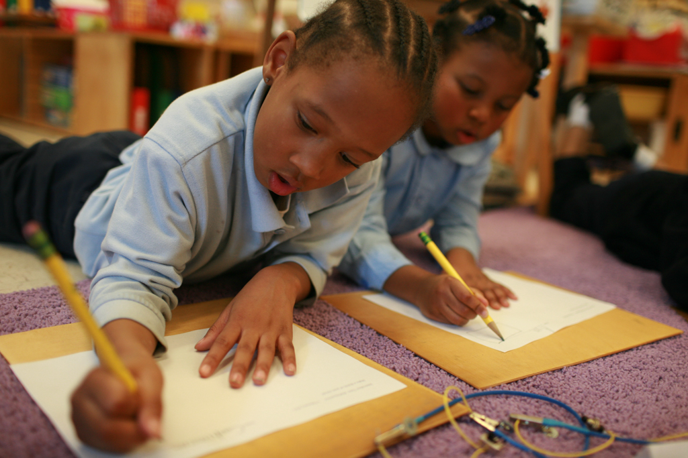
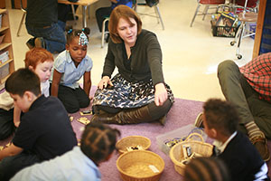

# The Children’s Innovation Project: Supporting Young Learners to Notice, Wonder, and Persist

*Watch the video: [The Children’s Innovation Project on Vimeo](https://vimeo.com/129009937)*

*The Children’s Innovation Project approaches technology as raw material to support broad interdisciplinary learning for children to develop habits of mind as innovators.*

The [Children’s Innovation Project](http://remakelearning.org/project/childrens-innovation-project/) began in 2010 when [CREATE Lab](http://remakelearning.org/organization/carnegie-mellon/carnegie-mellon-school-computer-science/robotics-institute/create-lab/) resident artist, [Jeremy Boyle](http://remakelearning.org/person/boyle-jeremy/) and Kindergarten teacher, [Melissa Butler](http://remakelearning.org/person/butler-melissa/) partnered to explore the question: “What might meaningful technology learning look like for young children?” Working together at [Pittsburgh Allegheny K-5](http://remakelearning.org/organization/pittsburgh-allegheny-k-5/), the pair began co-creating a learning progression of language-logic opportunities for children to deeply explore the material of technology.

With the Children’s Innovation Project, children explore and learn about electricity and simple circuits through hands-on engagement with [Circuit Blocks](http://www.ciplearningstore.com/circuit-block-sets/) and other raw materials, developing habits of mind to notice—wonder—persist. Children make connections to objects in their world—specifically through imagining about the insides of electronic toys, opening them to notice carefully, identifying components, and then repurposing and reconfiguring their internal components into new circuits and new ideas. Approaching technology as raw material allows technology to be a means to learning, not an end.

The pair began collaborating on various arts-integration projects back in 2003, when Boyle was Resident Artist at the [Mattress Factory](http://remakelearning.org/organization/mattress-factory/). Since 2010, they have focused on what they see as ’depth of possibility in broader interdisciplinary learning’ for children to develop precision of language, collaboration, and flexibility and fearlessness in problem solving.

Learning with the Children’s Innovation Project is for all children, not for enrichment groups or special pull-out programs.

Circuit Blocks have been iteratively designed locally in Boyle’s studio as part of the teaching and learning work of the Children’s Innovation Project since 2010. The production process mirrors the learning of the project through its slow and careful method of crafting these materials.

> I think everybody should know... how to make mistakes. If you don’t know how to make mistakes, it will be hard to work on a breadboard. I always make mistakes while on the breadboard.
>
> — Grade 4 student who has worked with the Children’s Innovation Project since Kindergarten

The Children’s Innovation Project shifts the focus of innovation from making some *thing*, to a focus on “finding something new inside something known.” This shift allows children opportunities to slow down and make their own authentic discoveries with materials and ideas. It is through this process of discovery that children are able to dig into struggles of not-knowing and find and follow their own internally-motivated curiosities. And as children think about themselves in relation to the process of their own learning, they begin to internalize sensibilities that support their growth as innovators.

In various classroom settings from Kindergarten through Grade 4, children practice what it means to **notice**: *slow down, there is always more to see*, **wonder**: *follow questions to find new questions*, and **persist**: *love and stay with your struggles*.

Children look at small screws and compare the patterns on the heads, the shapes of the tips and details of the threads. Across the hall, children wonder about the newly discovered and unknown components on the circuit boards in their opened electronic toys. Upstairs, children use magnifying glasses and read the color bands on resistors to decode their value in Ohms. Kindergarteners imagine the insides of their electronic toys for months before starting to open them slowly with screwdrivers. First graders try and fail and fail some more while inventing switches. Second graders struggle for weeks to find a way to make 3 lights glow brightly with one battery block (discovering parallel circuits). Fourth graders work on breadboards for months learning slowly and in layers how to create pathways from +3V to ground using LEDs, push-buttons and resistors. In all of these classrooms, teachers notice and wonder about *how* children are learning in order to support children’s metacognition.

*by Katy Rank-Lev*

## By the Numbers

Pittsburgh Allegheny K-5 is a Pittsburgh Public School where 97% of the students qualify for free or reduced lunch.

In 2010, the Children’s Innovation Project began with 20 students in one Kindergarten classroom at Pittsburgh Allegheny K-5.

In 2015, more than 300 students, 11 teachers, and 8 Teaching Fellows participate in the project at Allegheny and 28 students, 2 teachers, and 1 Teaching Fellow participate at [Pittsburgh Arsenal K-5](http://remakelearning.org/organization/arsenal-elementary-school/).

## Network in Action

**Mini-grants support early-stage projects. (Catalyze)**

Providing funding for new and innovative learning programs is an essential service of the [Remake Learning Network](http://remakelearning.org).

In 2011, Children’s Innovation Project received a [Spark award from The Sprout Fund](https://www.sproutfund.org/program/spark/), a Pittsburgh nonprofit that provides catalytic funding for early learning programs that help children develop hands-on skills and digital literacies. With support from Sprout, project co-directors Melissa Butler and Jeremy Boyle were able to focus on developing the project with the students in Butler’s kindergarten classroom. This early work set them up for iteration, learning, and growth.

## Persons of Interest

### Melissa Butler

Melissa Butler is a teacher in Pittsburgh Public Schools and co-director of the Children’s Innovation Project.

> We redefine innovation as finding something new inside something known as opposed to making something, and we redefine technology as raw material. We care about children having access to the thinking of technology, not the stuff of technology.

Melissa began working with artist Jeremy Boyle in 2003 when Jeremy was a Resident Artist at a museum located near her school on Pittsburgh’s Northside. After collaborating on numerous arts-integrated projects with children in Kindergarten through Grade 5, the pair developed the Children’s Innovaiton Project in 2010. As a “slow learning” approach to technology education for young children, the project uses technology as a raw material for learning, rather than an end in and of itself.

Since first beginning in Melissa’s classroom, the project has grown to serve more than 300 students and engage 13 teachers across multiple school buildings in Pittsburgh Public Schools. And through partnerships they’ve developed with other Remake Learning Network members like ASSET STEM Education and the Fred Rogers Center, Melissa and Jeremy are working to take the project to scale so more teachers can apply their approach.

### Jeremy Boyle

Jeremy Boyle is an artist, roboticist, and co-director of the Children’s Innovation Project.

> We define innovation as finding something new inside something known, which is a shift from thinking about innovation as always being the making of the new thing that takes something further or faster or larger. But we think that it’s really important, especially working with young children, to think about innovation in this frame that really allows the space to honor the discoveries that children make in the context that they’re in.

Jeremy began working with teacher Melissa Butler in 2003 when he was a Resident Artist at a museum located near her school on Pittsburgh’s Northside. After collaborating on numerous arts-integrated projects with children in Kindergarten through Grade 5, the pair developed the Children’s Innovaiton Project in 2010 while Jeremy was Artist-in-Residence at the CREATE Lab at Carnegie Mellon. As a “slow learning” approach to technology education for young children, the project uses technology as a raw material for learning, rather than an end in and of itself.

Since first beginning in Melissa’s classroom, the project has grown to serve more than 300 students and engage 13 teachers across multiple school buildings in Pittsburgh Public Schools. And through partnerships they’ve developed with other Remake Learning Network members like ASSET STEM Education and the Fred Rogers Center, Melissa and Jeremy are working to take the project to scale so more teachers can apply their approach.

## More Information

If you’re interested in learning more about Children’s Innovation Project, contact [Melissa Butler](http://remakelearning.org/person/butler-melissa/) and [Jeremy Boyle](http://remakelearning.org/person/boyle-jeremy/).

### Downloadable Materials

- [**Children’s Innovation Project Learning Store**](http://www.ciplearningstore.com/): Online store for the circuit blocks used by the Children’s Innovation Project.
- [**Introduction to Circuit Blocks**](http://www.ciplearningstore.com/introduction): Explanations and descriptions of terminology, functions, and activities using Circuit Blocks.
- [**Buy Circuit Blocks**](http://www.ciplearningstore.com/circuit-block-sets/): Pricing and selection of circuit blocks available for purchase.
- Children’s Innovation Project Documentary ( *forthcoming*)

### Online Resources

- [**Children’s Innovation Project Website**](http://www.cippgh.org/): Project website, which includes descriptions of the project, who is involved, contact information, etc.
- [**Children’s Innovation Project—Theoretical Frame**](http://www.cippgh.org/theoretical-frame/): Description of the project’s seven-part theoretical framework.
- [**Tech Integration Checklist**](http://www.fredrogerscenter.org/media/resources/Tech_Integration_Checklist_-_Final.pdf): Checklist for identifying exemplary uses of technology and interactive digital media for early learning; developed by the Pennsylvania Digital Media Literacy Project.
- [**Framework for Quality in Digital Media for Young Children**](http://www.fredrogerscenter.org/media/resources/Framework_Statement_2-April_2012-Full_Doc+Exec_Summary.pdf): Considerations for parents, educators, and media creators; developed by the Fred Rogers Center for Early Learning and Children’s Media.

### Related Projects & Partners

- [**Fred Rogers Center Early Learning Environment**](http://ele.fredrogerscenter.org/): Online toolkit and community for early learning technology.
- [**Arts & Bots**](http://artsandbots.posthaven.com/): A program in middle and elementary schools, kindergartens, and afterschool programs that engages students with robotics and authoring technology.
- [**Baby Promise**](http://kingsleyassociation.org/family/baby-promise/): An interactive early learning program hosted by the Kingsley Association that connects underserved families in Pittsburgh’s East End communities with educational resources.
- [**Message from Me**](http://www.messagefromme.org/): A tool (currently in the pilot stage) which enables young children to get experience communicating with others using digital technologies.
- [**CMU CREATE Lab**](http://www.cmucreatelab.org/): The Community Robotics, Education and Technology Empowerment Lab; explores the deployment of robotic technologies in socially meaningful ways to empower a technologically fluent generation.

---

*Add your comments and feedback about this case on [Medium](https://medium.com/remake-learning-case-studies/supporting-young-learners-to-notice-wonder-and-persist-ebfc65b4732).*
