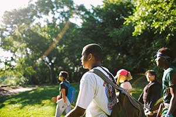

# City of Learning: Making Learning Visible with Digital Badges

*Watch the video: [City of Learning on YouTube](https://www.youtube.com/watch?v=kJlFkrPBRAI)*

*The Sprout Fund and dozens of community partners helped Pittsburgh become a summertime City of Learning.*

Learning doesn’t begin—or end—in the classroom. Yet much that’s gained in afterschool programs, community centers, and summer camp goes unrecognized, left out of a learner’s educational record and unseen by admissions officers and potential employers.

Digital badges are a new tool to recognize and celebrate a learner’s mastery of competencies. Within a framework of knowledge, skills, and dispositions, badges store in-depth information about learning experiences. A few clicks can reveal where the learning happened, what it took to earn the badge, and, in some cases, the evidence and learning artifacts behind the badge.

Badges emerged in the early 2010s through deep investments from the MacArthur Foundation and close work with Mozilla Foundation, the nonprofit behind the Firefox web browser. More recently, Pittsburgh joined Chicago, Dallas, and Washington, D.C., as “Cities of Learning” in a national campaign focused on keeping students engaged in meaningful learning opportunities over the summer.

The Sprout Fund created opportunities for dozens of Remake Learning Network partners to explore the potential for digital badges and reward learning happening outside the classroom, from museums and libraries to corporate offices and basketball courts.

During training workshops, educators and program leaders learned how to identify competencies based on their programs’ learning outcomes and highlight “badge-able moments” during their summer programming. Participants based their badge criteria on a shared set of learning competencies created through a working group process that included input from educators, subject matter experts, and practitioners in a variety of professional fields. This way, City of Learning partners could be sure the badges they designed had real value in the broader community.

A technology platform enabled badges to be awarded and cataloged available learning experiences across the city. This discovery platform was also used by program staff and mentors to identify and recommend new activities for learners to pursue interests and build on their personal strengths—to create their own personal learning pathway.

> In the real world, you’re never asked a question that someone else already knows the answer to. On the job, it’s all about finding new solutions.
>
> — Christine Cray, Director of Student Services Reforms, Pittsburgh Public Schools

Three major partnerships were forged that complemented the broader summer efforts. Pittsburgh Public Schools offered badges as part of morning academic classes and afternoon enrichment activities at its Summer Dreamers Academy. Meanwhile, the Three Rivers Workforce Investment Board assured that career readiness badges were available to youth participating in the Learn & Earn summer youth employment program. Badges awarded by the Carnegie Library of Pittsburgh incentivized teens to engage with its learning labs and stick with its summer reading program.

Finally, at a mid-summer forum of regional employers, program partners made the case that badges can be used to help identify job prospects with the attributes needed in today’s rapidly changing workplace.

“Anything that allows a candidate to demonstrate their passions, what they’re into, their hard skill set—as well as their soft skills—is very important for any employer that thrives on a mixture of creativity, artistic sensibility, and collaboration,” said Chris Arnold, general counsel and director of human resources at Pittsburgh-based video game design studio Schell Games.

Whether it’s through self-directed online experiences, peer-supported learning at a safe neighborhood space, or classroom instruction during those important school hours, badges are rapidly becoming the tool to connect these learning experiences together for academic achievement, for employment, and for an engaged citizenry.

## By the Numbers

In summer 2015, approximately 7,000 badges were uniquely earned by 1,600 learners from 34 participating organizations.

45% of badges issued recognized dispositions cultivated, 35% skills mastered, and 20% knowledge gained. One youth earned as many as 19 total badges while most earned about 4.

## Network in Action

**Large events focus network attention on issues and opportunities of critical importance. (Coordinate)**

In November 2014, The Sprout Fund hosted a massive, town hall-style meeting with more than 300 educators and 100 students at Pittsburgh’s downtown convention center. The event featured a mixture of remarks from stage, panel discussions, student presentation, table-based facilitation activities, science fair-style feedback stations, and an enthusiastic emcee.

Participants learned about digital badges and explored ways to connect in-school and out-of-school learning experiences to new pathways for opportunity for students in the greater Pittsburgh region. The momentum and enthusiasm generated at the event propelled the work of City of Learning forward between the two pilot summer seasons.

## More Information

If you’re interested in learning more about City of Learning, contact [Tim Cook](https://web.archive.org/web/20150921214905/http://remakelearning.org/person/cook-tim/).

---

*Add your comments and feedback about this case on [Medium](https://medium.com/remake-learning-playbook/making-learning-visible-with-digital-badges-57268c78a588).*
