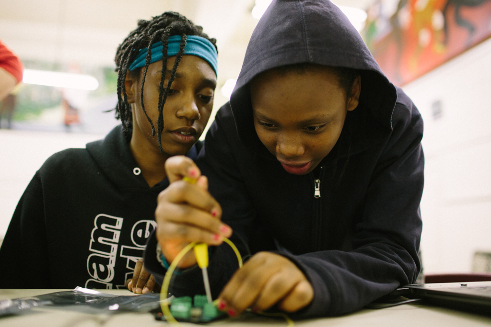

# The Digital Corps: Building Digital Skills with Mobile Mentors

*Watch the video: [The Digital Corps on Vimeo](https://vimeo.com/129009233)*

*The Digital Corps is a network of technology guides who engage Pittsburgh youth in digital literacy.*

The effects of the digital age are sweeping across the globe, transforming industries, and changing how people interact with the world around them. Kids engage with games, apps, and social networks all day long, and most of them are eager to learn more about what goes into that technology. Still, despite the ubiquity of computing and the need to prepare children for tomorrow’s workforce, most K-12 schools in the United States don’t teach computer science, and most out-of-school programs lack the capacity to teach digital literacy skills effectively.

In response to this digital literacy gap, [The Sprout Fund](http://remakelearning.org/organization/sprout-fund/), the steward of the [Remake Learning Network](http://remakelearning.org) in Pittsburgh, partnered with Allegheny Partners for Out-of-School Time ( [APOST](http://remakelearning.org/organization/allegheny-partners-for-out-of-school-time-apost/)), a United Way agency supporting out-of-school educators, to launch the [Digital Corps](http://remakelearning.org/project/digital-corps/). The program recruits and trains mentors in digital literacy and matches them with out-of-school learning sites throughout the city and county.

> We all have a role to play ensuring all our students are equipped with the digital literacy skills they’ll need for their future.
>
> — Hadi Partovi, Code.org

The Sprout Fund recruits a wide range of professionals from a variety of fields including formal education, robotics and engineering, and the fine arts. Once they join the program, Corps members enter a training program to help familiarize them with the digital tools. But, more importantly, the program allows the group at large to collaborate on best teaching practices so they can deliver more effective learning experiences and support positive youth development. The training sessions employ hands-on, “learn by doing” instruction activities that embody the spirit of the Corps.

In partnership with APOST, Sprout seeks host sites that are trusted members of their community and attract a steady afterschool population of tweens and teens. Ranging from established organizations like YMCAs, libraries, and churches to smaller neighborhood organizations, the Digital Corps provides everything needed for a successful session: the tech tools, the mobile Wi-Fi, even the snacks.

During each 90-minute Digital Corps session, participating youth can pursue learning tracks in Creative Computing, Webmaking, and Mobile Media. Through Creative Computing projects, students use [Scratch](http://remakelearning.org/resource/scratch/), [MaKey MaKey](http://remakelearning.org/resource/makey-makey/), and [Hummingbird Robotics Kits](http://remakelearning.org/resource/hummingbird/) to explore conductivity, engineering, and design. When focusing on Webmaking, students use [Mozilla Webmaker](https://webmaker.org/en-US) to learn HTML structure, web design, and storytelling. And when making Mobile Media, students use [Mozilla App Maker](https://apps.webmaker.org/designer) and MIT’s [App Inventor](http://remakelearning.org/resource/app-inventor/) to learn mobile design techniques, grid-math, and programming languages.

Digital Corps curricula not only teach technical skills, but also foster 21st century skills-development, teaching kids how critical thinking, communication, collaboration, and creativity are interconnected. Youth learn to ask questions (of each other and of instructors) and delve into support resources online to find and fix bugs in their own projects.

Each Digital Corps session is taught “studio” style, so teens are creating something tangible every week. “Learning by doing is a great method to get students asking questions, troubleshooting, and figuring things out together,” says [Ani Martinez](http://remakelearning.org/person/martinez-ani/), Digital Corps program associate at The Sprout Fund.

To help track the progress made by participating youth, Martinez and Digital Corps members have developed 20 [digital badges](http://remakelearning.org/blog/2014/11/19/digital-badges-give-credit-where-credit-is-due/) that students can earn in recognition of the knowledge they gain and the new skills they develop through the Digital Corps.

*by Katy Rank-Lev*

## By the Numbers

Studies estimate that the average young person spends 8 hours a day engaging with digital media.

Since launching in late 2013, the Digital Corps has delivered 795 hours of instruction to 700 young people.

The Digital Corps has trained 88 members and partnered with 46 afterschool host sites throughout Allegheny County.

## Network in Action

**Showcase events raise greater public awareness of local learning innovation. (Champion)**

In addition to partnering with host sites for 8-week deployments, the Digital Corps represents the Remake Learning Network at public events where they can reach hundreds of families all at once. These **showcase events for learning innovation** are designed to be fun, engaging, hands-on activities that can be set up at block parties, arts festivals, and maker parties—wherever children, youth, and families gather looking for new things to do.

## Persons of Interest

### Ani Martinez

Ani Martinez is an artist and out-of-school educator dedicated to closing the digital opportunity gap.

> Good youth engagement strategies, especially in the making and STEAM realms, have a low floor, a high ceiling and wide walls. Low floor means that they’re very accessible. A high ceiling means that, while it’s easy to engage with, the learning can be endless. And wide walls means that you can have varied learning, so you can serve a diverse set of learners.

A designer and community organizer by background, Ani Martinez got her start as a digital literacy innovator as, of all things, a weaver. After receiving her Bachelor of Fine Arts from Tyler School of Art, Ani became interested in the use of binary code in making complex tapestries. Beginning as a part-time educator in STEAM and digital literacy at the Pittsburgh Center for the Arts and Assemble, Ani leveraged her out-of-school experience to launch the Digital Corps in 2013.

Through the first two years of the Digital Corps, Ani has recruited 88 digital literacy coaches and partnered with 46 afterschool host sites throughout greater Pittsburgh. The Digital Corps has been an entry point for dozens of youth-serving organizations in some of the region’s most needful communities.

### Jomari Peterson

Jomari Peterson is a positive youth development mentor helping urban youth prepare for an entrepreneurial future.

> I believe that youth are capable of creating economic wealth and changing the world where they are now. I don’t think we should focus only on academic preparation for college, but provide young people with the technical skills to earn money right now if they choose.

Working with disconnected youth during the afterschool hours means Jomari has to constantly emphasize the economic empowerment that can come from greater technological fluency. So instead of just instructing kids on the basics of coding and web design, Jomari embeds those skills inside a larger project that challenges kids to become digital age entrepreneurs.

Jomari partnered tapped into the Remake Learning Network to partner with the Digital Corps, a team of digital literacy coaches who come into afterschool programs to provide free lessons in web design, app development, and robotics. Not only do the kids get exposure to new technology, but Jomari’s fellow mentors at the Maker’s Place can develop their own skills and offer ongoing tech classes.

## More Information

If you’re interested in learning more about the Digital Corps, contact [Ani Martinez](http://remakelearning.org/person/martinez-ani/).

### Downloadable Materials

- [Mentoring Manual for Digital Literacy coaches](http://www.scribd.com/fullscreen/241612718?access_key=key-Bg478gqESrAGRd9vGINd&allow_share=false&escape=false&show_recommendations=false&view_mode=scroll): Guide for being an effective youth mentor, adapted to the needs of digital learning coaches.
- [Guide for facilitating Digital Literacy workshops](https://theanimal.makes.org/thimble/MTYzMzIyMjkxMg==/facilitating-digital-corps-workshops): Teaching kit designed to help Digital Corps members structure their facilitation process.
- Digital Literacy Passport: A printed booklet learners can use to keep track of what they learn and reflect on their new skills. (*forthcoming*)
- [Creative Computing Teaching Kit](https://theanimal.makes.org/thimble/LTE4NDI4MDY1Mjg=/computation-creation-with-scratch-teaching-kit): Curriculum for teaching computational creation using Scratch, MaKeyMaKey, and Hummingbird.
- [Webmaking Teaching Kit](https://theanimal.makes.org/thimble/LTExMzU4MDQxNjA=/digicorps-webmaker-teaching-kit): Curriculum for teaching webmaking using Mozilla Webmaker suite.
- [Mobile Media Teaching Kit](https://theanimal.makes.org/thimble/MTMyMTY2NDc2OA==/digicorps-mobile-media-teaching-kit): Curriculum for teaching mobile design using coding languages and Mozilla Appmaker.

### Online Resources

- [The Digital Corps online](http://thedigitalcorps.org/): Digital Corps home website.
- [Mozilla Webmaker](https://webmaker.org/en-US): Mozilla’s open-source educational initiative to “help millions of people move from using the web to making the web.”
- [ScratchEd](http://scratched.gse.harvard.edu/): An online community for Scratch educators.
- [Hummingbird Teaching Community](http://www.hummingbirdkit.com/community): An online community for Hummingbird educators.
- [Digital Learning Tool Catalog](http://remakelearning.org/tools/): Remake Learning’s compilation of free, low-cost and open-source digital literacy learning tools.

### Related Projects & Partners

- [Tinker Squads](http://www.tinkersquads.org/): A similarly-modeled Pittsburgh afterschool program for girls centered on making and creativity.
- [Mobile App Lab](https://sites.google.com/a/mobileapplab.org/mobile-app-lab/): An afterschool computer lab implemented to improve youth programming skills and build capacity within schools to teach programming.
- [Computer Science Student Network](http://cs2n.org/): A collaborative research project between Carnegie Mellon University and the Defense Advanced Research Projects Agency designed to encourage student engagement in computer science, science, technology, engineering, and mathematics.
- [Arts & Bots](http://artsandbots.posthaven.com/): A program in middle and elementary schools, kindergartens, and afterschool programs that uses Hummingbird Robotics Kits to engage young people in creative technology projects.

---

*Add your comments and feedback about this case on [Medium](https://medium.com/remake-learning-case-studies/building-digital-skills-with-mobile-mentors-d79be22a49c7).*
