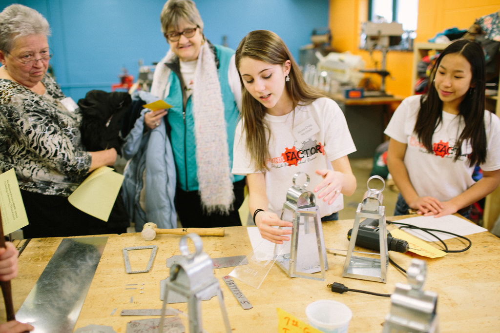
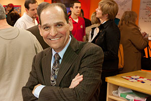
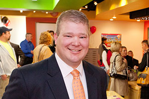

# Elizabeth Forward School District: Transforming a School District, One Classroom at a Time

*Watch the video: [Elizabeth Forward School District on Vimeo](https://vimeo.com/129009614)*

*Elizabeth Forward School District empowers educators and students to re-imagine the future of K-12 education and then make it a reality.*

Elizabeth, Pennsylvania, might be considered an unlikely place to find the cutting edge of technology and innovation. In an old river town fighting to recover from recession, and in a public education environment marked by increasing standards and decreasing budgets, [Elizabeth Forward](http://remakelearning.org/organization/elizabeth-forward-school-district/) stands out as one of the most innovative school districts in America.

When Superintendent [Bart Rocco](http://remakelearning.org/person/rocco-bart/) and Assistant Superintendent [Todd Keruskin](http://remakelearning.org/person/keruskin-todd/) started at Elizabeth Forward, the district was hardly a hotbed of education innovation. Students were dropping out at alarming rates and opting for charter or cyber schools. The school was stuck in the middle of the pack on state standardized test scores, and teachers were struggling to keep students engaged.

Still, there was opportunity for the district, located just 30 minutes from Pittsburgh’s research universities, education technology companies, cultural institutions, philanthropies, and civic leaders. Tapping into the [Remake Learning Network](http://remakelearning.org), Rocco and Keruskin began transforming their district—one space, one program, one teacher, and one student at a time.

> Elizabeth Forward is a living example of the triumph of opportunity over challenge in American education.
>
> — Karen Cator, President and Chief Executive Officer, [Digital Promise](http://www.digitalpromise.org/)

Early in their tenure at Elizabeth Forward, Rocco and Keruskin attended an event at the [Allegheny Intermedia Unit](http://remakelearning.org/organization/aiu/) to hear a speech by [Don Marinelli](http://remakelearning.org/person/marinelli-don/), then-executive director of Carnegie Mellon’s Entertainment Technology Center ( [ETC](http://remakelearning.org/organization/carnegie-mellon/etc/)). Intrigued, they followed up with Marinelli, who suggested they partner with ETC and local education technology company [Zulama](http://remakelearning.org/organization/zulama/) to transform a space in their district. With guidance from these partners, district leaders, teachers, students, and facilities staff came together to create the [Entertainment Technology Academy](http://remakelearning.org/project/entertainment-technology-academy/), a classroom that does away with the rows of desk and chalk board in favor of a flexible and collaborative learning space. Teachers use game design theory to offer engaging, effective English, math, art, design, and computer science curriculum. Encouraged, Elizabeth Forward’s leadership didn’t stop there.

Next came the [EF Media Center](http://remakelearning.org/project/elizabeth-forward-media-center/), which transformed the static school library into an attractive high school hangout space with comfortable seating, gaming consoles, a stage, and state-of-the-art audio and video production studios. Then came the [SMALLab](http://remakelearning.org/project/smallab/), an interactive digital media space that used gaming to provide fun, kinesthetic educational opportunities for middle school students. Next came the [Dream Factory](http://remakelearning.org/project/dream-factory-efms/), combining the middle school’s art studio, shop class, and computer science lab into one integrated innovation space. In 2013, Elizabeth Forward launched a district-wide 1:1 technology learning initiative for every student K-12. In 2015, they partnered with [Chevron](http://remakelearning.org/organization/carnegie-museums/carnegie-science-center/chevron-center-for-stem/) and the ETC to build an interactive [Energy Lab](http://www.edlinesites.net/pages/EF_MiddleSchool/Important_Links/Energy_Lab) for middle school students to learn about Earth, space, and energy concepts.

Rocco and Keruskin formed strategic partnerships with regional and national education innovators to advance their work, but they consistently remained grounded in the district, working closely with their school board, teachers, and students to develop, adapt, and improve spaces and programs.

Today, the district is one of more than 70 members of Digital Promise’s [League of Innovative Schools](http://www.digitalpromise.org/league). More importantly, though, student test scores are up, their dropout rates are down, and the transition from “frontierland” to “futureland,” as Superintendent Rocco likes to say, is well under way.

*by Liberty Ferda*

## By the Numbers

In the 2009-2010 academic year, 24 of Elizabeth Forward’s approximately 800 students dropped out. Four years later, only one student dropped out during the 2012-2013 school year.

Of 497 Pennsylvania school districts ranked by the Pittsburgh Business Times, Elizabeth Forward moved up 82 spots between 2009 and 2013.

Enrollment in voluntary summer enrichment programs has shot up more than 500% since 2009.

*These statistics have been corrected to reflect available data.*

## Network in Action

**Site tours share the best of the network with visitors from other regions. (Communicate)**

Elizabeth Forward has tapped in to the Remake Learning Network to share its success with other districts seeking to reimagine how teaching and learning works in today’s classrooms. Responding to growing demand to see Elizabeth Forward’s transformation in action, the district offers monthly tours for teachers and administrators. To date, the district has hosted more than 400 educators from more than 100 school districts from around the world.

## Persons of Interest

### Bart Rocco

Bart Rocco is the superintendent of Elizabeth Forward School District where he has worked to transform the school culture since 2009.

> This was a completely different way of looking at schools and how you redesign spaces for children. We learned basic principles about the design process, how we need to teach children these ideas of resiliency and that failure is part of the process of learning and that habits of mind will help kids move forward in the world that they’re going to enter because it’s a different kind of a process than it was years ago.

Bart began his career as a teacher of English and Journalism, eventually working as a Principal and Assistant Superintendent. Shortly after his appointment to Elizabeth Forward, Bart recruited local high school principal Todd Keruskin to serve as his Assistant Superintendent. While Bart has stewarded the district and provided critical leadership, Todd has worked to generate partnerships to develop, improve, and expand innovative learning practices at Elizabeth Forward. Working together with the faculty and staff, Bart and Todd have transformed the experience of school, from Kindergarten through Senior Year.

By forming mutually beneficial partnerships with the Pittsburgh’s regions higher education community, ed-tech businesses, and other school districts, Bart has led the transformation of the Elizabeth Forward School District one space, one program, one teacher, and one student at a time.

### Todd Keruskin

Todd Keruskin is Assistant Superintendent at Elizabeth Forward School District where he has worked to transform the school culture since 2009.

> You know, it’s 2015. We’re 15 years in the 21st century and schools are still talking about STEM and STEAM, but if you look closely you’ll see a lot of schools haven’t changed. A lot of schools have not integrated computer science at an early age. A lot of schools haven’t introduced robotics to every student, digital fabrication, all the things we know are 21st-century skills.

A physics major and former science teacher, Todd came to Elizabeth Forward eager to breathe new life into the district’s science, technology, engineering, and math (STEM) curriculum. After meeting Don Marinelli, co-founder of Carnegie Mellon’s Entertainment Technology Center, at a Remake Learning event, Todd realized the essential role of the arts and creativity in preparing students to thrive in the creative economy. Working in tandem with EFSD superintendent Bart Rocco, Todd has tapped into the energy and enthusiasm of the district’s faculty, facilities staff, and student body to imagine together what school can look like in the 21st century, even in a semi-rural district like Elizabeth Forward.

By forming mutually beneficial partnerships with the Pittsburgh’s regions higher education community, ed-tech businesses, and other school districts, Todd has instigated the transformation of the Elizabeth Forward School District one space, one program, one teacher, and one student at a time.

## More Information

If you’re interested in learning more about Elizabeth Forward, contact [Todd Keruskin](http://remakelearning.org/person/keruskin-todd/).

---

*Add your comments and feedback about this case on [Medium](https://medium.com/remake-learning-case-studies/transforming-a-school-district-one-classroom-at-a-time-5ef56b836067).*
