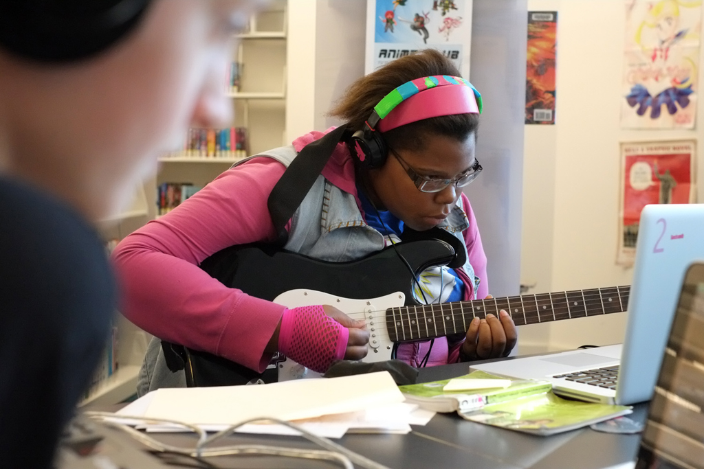

# The Labs @ CLP: Making Noise at the Library

*Watch the video: [The Labs @ CLP on YouTube](https://www.youtube.com/watch?v=t8AvT4uKYAU)*

*The Labs is transforming the Carnegie Library of Pittsburgh from a repository of information into a laboratory of exploration, learning, and discovery.*

Some teens are naturally drawn to libraries. In fact, according to the Pew Research Center, teens are the biggest library user group in the United States. [The Labs @ CLP](https://remakelearning.org/project/labs-at-clp/) is part of a growing nationwide effort to enhance traditional library services by creating new offerings that meet the needs of today’s digital teens.

The Labs is [Carnegie Library of Pittsburgh](https://remakelearning.org/organization/carnegie-library/) ’s teen-only creative technology program. By integrating innovative 21st century learning opportunities into the library setting, The Labs enables teens to immerse themselves in filmmaking, photography, music composition, art, and even video game design. These offerings not only engage teens, they represent opportunities that may not exist in school or at home. Sometimes, the programming involves workshops with specific training and tutorials. Sometimes, the library offers “Open Labs,” where teens can simply explore available resources to spark their curiosity. Either way, teens are opting-in to valuable learning experiences in community spaces around the corner from where they live.

Led by Digital Learning Librarian [Corey Wittig](https://remakelearning.org/person/wittig-corey/), The Labs is helping CLP redefine its role in the digital age. “The future of the library isn’t one patron coming in and working in isolation,” Wittig says. “It’s going to be a more networked experience, more hands-on, and with more tools available. That’s the experience teens today have in The Labs.”

Programs like The Labs @ CLP don’t just benefit students—they benefit libraries. These are community institutions charged with cultivating and nourishing intellectual curiosity, cultural exchange, and lifelong learning. Today, those goals are increasingly achieved through new technologies. Libraries that take advantage of tools and techniques of the digital age can both advance their mission and boost participation. In the future, libraries may look less like static sanctuaries of arcane knowledge and more like active laboratories of learning.

> The Labs @ CLP is a wonderful example of libraries adapting themselves for a new generation.
>
> — Maura Marx, Deputy Director, [Institute of Museum and Library Services](https://www.imls.gov/)

The Labs includes permanent, dedicated digital teen spaces at three of the Carnegie Library’s 19 neighborhood locations where teenagers have free access to creative, informal project-based activities using digital and traditional technologies.

A typical open session might include a music station with a microphone and recording software, an electric guitar, a digital pad that renders drawings into graphic designs, and a tablet with a stop-motion animation app. Workshops are more structured, allowing teen specialists and mentors to present planned activities focusing on building digital literacies.

To make sure teens can participate in the program no matter which branch library they call home, The Labs developed “Labs on Location” kits containing tools, materials, and instruction manuals for bringing digital learning to life across the city. Each week, a mentor visits a different CLP location to guide the local teen specialist through the software and technology integral to that day’s lesson before co-facilitating that day’s session.

The programs are often light and fun, but they still have significant impact on the lives of many teenagers. One teen uses The Labs to pursue his interest in technology. Captivated by the game [Minecraft](https://remakelearning.org/resource/minecraft/), he was encouraged by mentors at The Labs to explore more deeply, so he began doing research before sharing new Minecraft skins he created. Eventually, he gave the library staff tutorials on the game, before moving on to musical composition, robotics construction, and video game creation.

Above it all, The Labs creates a safe space where teens can learn while they unwind. At the end of a costume-making workshop one teen said, “This was really fun. I was having a bad day, and now I feel better.”

*by Weenta Girmay*

## By the Numbers

Since launching in 2012, more than 5,000 teens have participated in programming at The Labs.

The Labs has permanent space in 3 of CLP’s 19 branches, and The Labs on Location initiative has expanded its reach to all branches through mobile programming.

The Labs average more than 200 participants per month.

## Network in Action

**Sharing resources with partner programs leverages strengths of the network. (Coordinate)**

In addition to creating its own original workshops, The Labs coordinates programming with other [Remake Learning Network](https://remakelearning.org) members to host guest sessions in its spaces, expanding the range of program choices teens have, and also helping partner programs raise their level of exposure in the community.

The Labs has hosted fine arts programming from the [Carnegie Museum of Art](https://remakelearning.org/organization/carnegie-museums/carnegie-museum-art/) and [Mattress Factory](https://remakelearning.org/organization/mattress-factory/) contemporary art gallery, media production tutorials from [Pittsburgh Filmmakers](https://remakelearning.org/organization/pittsburgh-filmmakers/) and [Hip Hop on L.O.C.K.](https://remakelearning.org/project/hip-hop-on-lock/), and maker workshops from [TechShop](https://remakelearning.org/organization/techshop-pittsburgh/).

## Person of Interest

### Corey Wittig

Corey Wittig is a digital learning librarian at the Carnegie Library of Pittsburgh where he leads The Labs @ CLP, teen-only spaces for learning and creativity.

A big part of the Labs is just taking advantage of the fact that libraries are already a place that low-income kids are going after school. People come for the programming, but I think the biggest portion of our kids just wandered in from the neighborhood and encounter staff and they see the stuff that’s here. Maybe they came in just for a computer and a place to be, and then they’re like “Oh wow, there’s all this stuff!”

Corey supports the library’s cadre of teen specialists and mentors to create a wide variety of programming that meets kids where they are, builds on their interests, connects them with peers, and supports their informal, self-directed learning. Plus, the library saves space each week for “Open Labs” when kids can hang out and mess around with whatever they’d like during unstructured time.

Because of The Labs, teens at many Pittsburgh libraries can now immerse themselves filmmaking, photography, music composition, art and design, and even video game design. Teens access equipment and support not readily available to them at home or at school. More than that, they have a community where they can explore their interests with peers and mentors who share their excitement.

## More Information

If you’re interested in learning more about The Labs, contact [Corey Wittig](https://remakelearning.org/person/wittig-corey/).

### Downloadable Materials

- [**CLP Teens Badge Criteria**](../docs/downloads/case-studies/labs/badge-criteria.zip): Criteria for three badges (Library Navigator, Basic Circuits, and Stop-Motion) that the CLP offers, including resources, a checklist, and terms and skills required to earn each badge.
- [**CLP Labs Instructional Comics**](../docs/downloads/case-studies/labs/instructional-comic-guides.zip): Comics with illustrated instructions for using the Labs’ technologies, including the stroboscopic camera, drum machine, Hummingbird kit, and stop-motion kit.
- [**Teens, Digital Media, and the Chicago Public Library Research Report**](http://ccsr.uchicago.edu/sites/default/files/publications/YOUmedia%20Report%20-%20Final.pdf): Report from May 2013 generated by the University of Chicago Consortium on Chicago School Research describing the innovations in the Chicago Public Library system.

### Online Resources

- [**CLP Teens Website**](http://www.carnegielibrary.org/teens/): CLP’s web portal for their teen programming at all library branches.
- [**CLP Teens YouTube Channel**](https://www.youtube.com/user/CLPTeens/videos): Uploads of projects made by teens using digital technologies in the lab and promotional videos for CLP’s teen programming.
- [**The Library as Incubator Project**](https://web.archive.org/web/20151031171912/http://www.libraryasincubatorproject.org/): A project to explore and highlight relationships between artists and libraries and advocate for libraries as incubators of the arts.
- [**Urban Libraries Council**](https://www.urbanlibraries.org/): Membership association of public library systems that advances the value of libraries to provide 21st century educational opportunities.
- [**YOUmedia Learning Lab Network**](http://www.youmedia.org/): A national network dedicated to expanding the reach and impact of the learning lab model.

### Related Projects & Partners

- [**Carnegie of Homestead Library**](https://carnegieofhomestead.com/library/kids-teens/): A public library in the Homestead neighborhood of Pittsburgh with programming and resources specifically curated for kids and teens, including digital learning and making.
- [**Millvale Community Library**](https://www.millvalelibrary.org/): A public library in the Millvale neighborhood of Pittsburgh that aims to be a powerhouse of local involvement and curates programming and resources for kids and teens.
- [**Allentown Learning and Engagement Center**](http://www.brashearkids.com/2014/05/all-about-alec.html): A collaborative effort of the Brashear Association and CLP that serves as a community asset offering a wide array of programming for all ages, including digital literacy and making programs for children.
- [**Elizabeth Forward Media Center**](https://remakelearning.org/project/elizabeth-forward-media-center/): Elizabeth Forward High School’s library, which includes non-traditional library technologies including a café, stage, board games, video games, and a video studio.

---

*Add your comments and feedback about this case on [Medium](https://medium.com/remake-learning-case-studies/making-noise-at-the-library-fb0e740cc9a7).*
