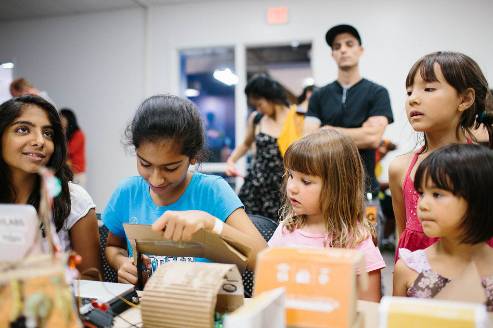

# Maker Parties: Throwing a Party Where Guests Come to Learn

*Watch the video: [Maker Parties on YouTube](https://www.youtube.com/watch?v=k3GPTi0_Kto)*

*Maker Parties create free, open, and accessible events for anyone to engage with hands-on learning activities that are fun and creative.*

How do you make learning an exciting and fun part of life for kids who’d rather be doing anything but? Part science fair and part arts festival, [Maker Parties](https://teach.mozilla.org/events/) offer a wide sampling of arts- and technology-based activities that turn learning into a party for children, youth, and families.

Globally, [Mozilla](https://www.mozilla.org/en-US/), the nonprofit working to keep the Web open and accessible to all, organizes and promotes Maker Parties as a way to introduce hundreds of thousands of people to new digital learning opportunities. Maker Parties bring together local organizations, educators, community members, and skilled mentors to host a free hands-on, pop-up learning event for teens and tweens.

The impact of a Maker Party is two-fold. First, it creates a unique exposure opportunity for learners to engage in web literacy learning—many, for the first time. Second, it expands the reach of local service organizations, which can engage new students and parents with compelling programming.

In Pittsburgh, Maker Parties are one of several public showcase events hosted by members of the [Remake Learning Network](http://remakelearning.org) to create anywhere, anytime learning opportunities. [The Sprout Fund](http://remakelearning.org/organization/sprout-fund/) organized Pittsburgh’s first Maker Party in 2013 when it launched a local [Hive Learning Network](https://www.sproutfund.org/program/hive/). And, in 2014, four additional Maker Parties popped up in neighborhoods throughout the city.

> Maker Party joins thousands of people across the globe to make something amazing, teach each other new skills, and have a great time doing it.
>
> — Chris Lawrence, V.P. of Learning, Mozilla Foundation

Maker Parties can be any size, with small parties ranging from 2 to 5 participants, medium parties ranging from 5 to 50 people, and large events involving 50 or more. Larger Maker Parties include stations where learners can make physical and digital projects like animations, web apps, and games. In order to keep the crowd moving among stations, activities are simple enough that they can be explored in as little as 5 minutes, but deep enough to last longer if they capture a young person’s interest.

At the big [Pittsburgh Maker Party in 2014](http://remakelearning.org/opportunity/2014/08/02/maker-party-2014/), arts education organizations from the Remake Learning Network offered traditional activities like the [Andy Warhol Museum](http://www.warhol.org/)’s screen-printing station and the [Society for Contemporary Craft](http://remakelearning.org/organization/society-for-contemporary-craft/)’s papermaking workshop, while [Assemble](http://remakelearning.org/organization/assemble/) and [TechShop](http://remakelearning.org/organization/techshop-pittsburgh/) offered maker learning experiences that bridged art and technology. The [Digital Corps](http://remakelearning.org/project/digital-corps/) led sessions on webmaking and programming, while [Steeltown Entertainment](http://remakelearning.org/organization/steeltown-entertainment/) helped kids make short films and animations.

And of course, free music and food truck delicacies helped make the event a complete experience.

“I worked on the Thimble coding,” said one teenager at the 2013 Pittsburgh Maker Party. “What we did was we placed pictures in boxes and we put captions there. So, I wrote an online story about pancakes and dancing. It was really cool.”

The Maker Party campaign builds on a long history of learning pop-ups that happen in neighborhoods, at summer festivals, and holiday events all over. To update these age-old events for the digital age, Mozilla has collected resources at [teach.mozilla.org](http://teach.mozilla.org), including step-by-step guidance on event execution, promotional materials, and low-fi teaching kits for use when there’s not Wi-Fi on-site.

*by Weenta Girmay*

## By the Numbers

In 2014, there were 2,515 maker parties in 86 countries. Those parties engaged more than 300 organizational partners, who recruited 1,036 mentors to teach 127,200 learners around the world.

Pittsburgh hosted five community Maker Parties in 2014, engaging more than 500 young people in a range of hands-on experiential learning.

---

*Add your comments and feedback about this case on [Medium](https://medium.com/remake-learning-case-studies/throwing-a-party-where-guests-come-to-learn-48b38f4c9814).*
