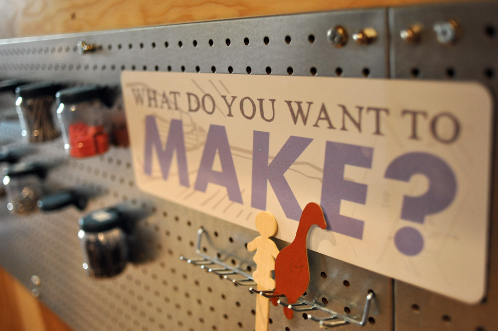
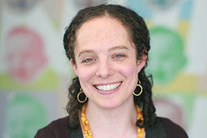

# MAKESHOP at the Children’s Museum of Pittsburgh: Exploring Digital & DIY Learning at the Museum

*Watch the video: [MAKESHOP at the Children’s Museum of Pittsburgh on YouTube](https://www.youtube.com/watch?v=Xj2x_vgrbWc)*

*MAKESHOP at the Children’s Museum of Pittsburgh creates space for kids to use their hands and minds to bring ideas to life.*

In 2010, Children’s Museum director [Jane Werner](http://remakelearning.org/person/werner-jane/) and [Drew Davidson](http://remakelearning.org/person/davidson-drew/) from Carnegie Mellon’s Entertainment Technology Center ( [ETC](http://remakelearning.org/organization/carnegie-mellon/etc/)), got to chatting at a network event. They started discussing the Maker Movement and the ways in which increasing access to physical and digital tools and techniques may enable children and youth to express their interests and make almost anything. They wondered what would happen if they developed a space in the [Children’s Museum of Pittsburgh](http://remakelearning.org/organization/childrens-museum/) where visitors could explore, imagine, and create through making as a learning process. Not only would it enhance the educational value of the Museum’s offerings, it would bring more children and families through the doors and encourage them to stay for longer.

In partnership with the ETC and the University of Pittsburgh Center for Learning in Out-of-School Environments ( [UPCLOSE](http://remakelearning.org/organization/pitt/upclose/)), the Children’s Museum began prototyping programs in electronics, sewing, woodworking, and digital media and studying how children and families engaged in hands-on maker learning.

[Dr. Lisa Brahms](http://remakelearning.org/person/brahms-lisa/) is the Director of Learning and Research at the Museum. Dr. Brahms began her work in the Museum as an UPCLOSE research fellow studying the development of [MAKESHOP](http://remakelearning.org/project/makeshop/) from its earliest stage to its current status as a permanent exhibit for hands-on learning. She now leads the effort to understand and develop the Museum as a place of informal learning.

Four years later, MAKESHOP is a fully-staffed, permanent exhibit offering ongoing programs for children, youth, adults, and educators. Tailoring the visitors’ experiences to their interests, MAKESHOP encourages exploration, creativity, and play by offering access to the materials, tools, and processes of making.

> MAKESHOP has really made us think differently about what it means to be a museum and the role of museums in people’s lives.
>
> — Jane Werner, Executive Director, Children’s Museum of Pittsburgh

The purpose of MAKESHOP is to challenge and nurture creativity by offering experiences with real materials and real tools that match visitors’ interests. The people, or educators, are key to the ongoing success of MAKESHOP, and identifying educators who are also skilled makers has proved essential. MAKESHOP educators continue to work hard to prototype how access to various tools, materials, process, and ideas affect the design of visitor learning experiences and facilitation.

The results of MAKESHOP’s careful process have been significant. At the Children’s Museum, attendance is up since MAKESHOP’s inception, and the average age of child-visitors has increased. Families’ engagement is noticeably deeper and prolonged. Through partnerships and outreach with schools, libraries, and out-of-school learning sites, the Children’s Museum has helped these organizations grow educator capacity and integrate making in meaningful ways. Through its annual [Maker Educator Boot Camp](https://pittsburghkids.org/education/maker-educator-bootcamp), the Museum has provided educators with maker-based professional development opportunities that can be put to use in the classroom. MAKESHOP has also partnered with the [Maker Education Initiative](http://makered.org/) to host and train Maker Corps members who can facilitate making experiences across the region.

Now MAKESHOP is reaching beyond the walls of the Museum, working with schools and out-of-school educators to develop engaging, effective, and evidence-based maker learning opportunities for a diverse array of the region’s kids.

*by Liberty Ferda*

## By the Numbers

More than 100 teachers participated in the 2013-2014 Maker Education Boot Camp Program, with more than 70% reporting significant or transformative change in their professional practice as a result.

In 2014, the Children’s Museum began a cooperative project with the [Institute of Museum & Library Sciences](http://www.imls.gov/) to create a national framework which identifies the key elements that support learning in museum and library makerspaces.

In 2012, the Children’s Museum received a $440,000 grant from IMLS to conduct foundational research on family learning in museum makerspaces.

## Network in Action

**Network research gathers evidence of what’s working for sharing with other regions. (Coordinate)**

In the spirit of sharing resources, the Learning and Research team has worked with MAKESHOP staff to identify seven core learning practices that empirically describe children’s engagement in MAKESHOP—inquire, tinker, seek and share resources, hack and repurpose, express intention, develop fluency, and ’simplify to complexify’—creating a common language around making as a learning process.

This important network research has created definitions to help maker educators both in the [Remake Learning Network](http://remakelearning.org) and elsewhere deepen their understanding of making and translate the practices of MAKESHOP to other contexts.

## Persons of Interest

### Jane Werner

Jane Werner is Executive Director of The Children’s Museum of Pittsburgh where she works closely with museum educators, exhibit designers, and learning scientists to develop innovative learning experiences for the whole family.

> Even though Pittsburgh is a very small town, and you feel like you’ve met everyone, the Remake Learning just put me in contact with people that create unlikely partnerships. And I think those unlikely partnerships are where the real creativity happens.

Jane began her career as an exhibit designer before assuming leadership of The Children’s Museum in 1999 and overseeing a decade in which the museum’s space, audience, and educational approach evolved dramatically. At a Remake Learning event in 2010, she met Drew Davidson and Jesse Schell from CMU’s Entertainment Technology Center. Together they hatched a plan to create a makerspace in the museum. In partnership with the ETC and the University of Pittsburgh Center for Learning in Out-of-School Environments (UPCLOSE), the Children’s Museum began prototyping hands-on maker learning programs and studying how children and families engaged.

Today, with more than 250,000 visitors per year, the museum is recognized as one of the best in the U.S. by Parents Magazine and MAKESHOP is a national model for family learning.

### Lisa Brahms

Lisa Brahms is Director of Learning & Research at the Children’s Museum of Pittsburgh where she brings a learning scientists’ eye to the design of new exhibits and programs.

> Everything in MAKESHOP is flexible. Nothing is fixed except for the beams that hold up the structure. And that’s intentional so that we are learning every day and understanding ourselves better every day and understanding the needs of our visitors every day and understanding the differences in how visitors learn.

Lisa began her work at the Children’s Museum as an research fellow from the University of Pittsburgh’s Center for Learning in Out-of-School Environments studying the development of MAKESHOP from its earliest stage to its current status as a permanent exhibit for hands-on learning. She now leads the effort to understand and develop the Museum as a place of informal learning.

Lisa has overseen the development of MAKESHOP as not only an effective learning environment, but as a model both locally for school teachers integrating maker learning practices into their classrooms and nationally through a framework which identifies the key elements that support learning in museum and library makerspaces.

## More Information

If you’re interested in learning more about MAKESHOP, contact [Lisa Brahms](http://remakelearning.org/person/brahms-lisa/).

### Downloadable Materials

- [**Building and Sustaining a Thriving Maker Hub**](http://makered.org/wp-content/uploads/2014/12/Building-and-Sustaining-a-Thriving-Maker-Hub.pdf): Case study describing various programs in Pittsburgh doing pioneering work in the maker education field.
- [**MAKESHOP’s YouTube Playlists**](https://www.youtube.com/user/pghmakeshop/playlists): Interviews with educators and student makers and video documentation produced by MAKESHOP about the space and process.
- [**The Learning Practices of Making: An Evolving Framework for Design**](http://makeshoppgh.com/wp-content/uploads/2015/02/MAKESHOP-Learning-Practices-formatted_FINAL_Feb-2015.pdf): In-depth description of MAKESHOP’s Learning Practices.
- [**Make a Makerspace**](http://makeshoppgh.com/resources/make-a-makerspace/): MAKESHOP’s recommendations for the design and development of making experiences for learning.
- [**Makerspace Playbook**](http://makered.org/wp-content/uploads/2014/09/Makerspace-Playbook-Feb-2013.pdf)**:** A resource for teachers, parents, and makers to make it easier to launch a space and get a program up and running.
- [**Handmade in MAKESHOP**](https://s3.amazonaws.com/cmop_production/downloads/256/CMP_MakeShop_Catalog_2015_web_3_.pdf): A catalog of MAKESHOP’s offerings, activities, exhibits, and furnishings.

### Online Resources

- [**Making & Learning: Building a Framework for Making in Museums & Libraries**](https://makingandlearning.squarespace.com/): A site for makerspaces in museums and libraries to join the conversation, share work, and connect.
- [**MAKESHOP Educator & Professional Opportunities**](http://makeshoppgh.com/resources/educator-professional-opportunities/): Descriptions of MAKESHOP’s programs for maker educators and schools.
- [**MAKESHOP Kickstarting Making in Schools**](http://makeshoppgh.com/resources/kickstarting-making-in-schools/): Collaboration between MAKESHOP and area schools to create avenues for schools to learn more about making.
- [**Questions to Think About in Maker Spaces**](http://mindfulmakerkids.info/)**:** A set of questions (with downloadable poster) that “Mindful Makers Ask Themselves” to encourage effective making.
- [**Make Your Own Maker Space**](http://www.hfrp.org/complementary-learning/snapshots/make-your-own-maker-space): Tips from Lisa Brahms for creating engaging maker spaces for children and families.

### Related Projects & Partners

- [**The Maker’s Place**](http://themakersplace.org/): An entrepreneurship, science, technology, engineering, art and math focused out-of-school time program in Pittsburgh.
- [**TechShop Pittsburgh**](http://www.techshop.ws/pittsburgh.html): A community-based workshop and prototyping studio on a mission to democratize access to the tools of innovation.
- [**Hilltop YMCA Creator Space**](http://www.ymcaofpittsburgh.org/hilltop-ymca/ymca-creator-space/): An out-of-school space designated to teach STEM (Science, Engineering, Technology, and Math) concepts to local youth through making.
- [**Manchester Craftsmen’s Guild Youth & Arts**](http://mcgyouthandarts.org/): Arts and career training center whose mission is to educate and inspire urban youth through the arts.

---

*Add your comments and feedback about this case on [Medium](https://medium.com/remake-learning-case-studies/exploring-digital-diy-learning-at-the-museum-c0392af922f7).*
