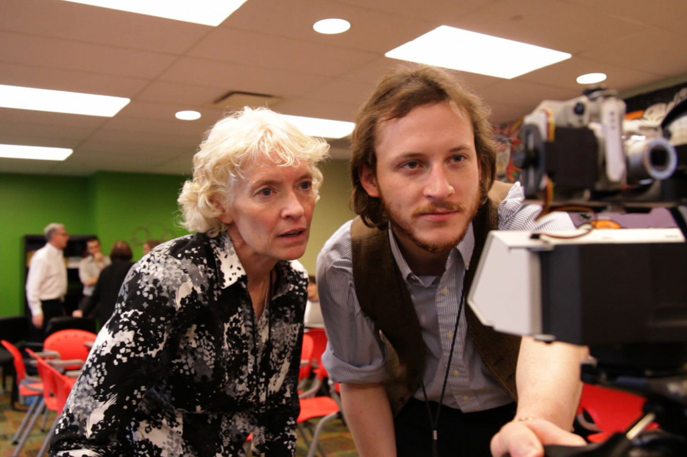
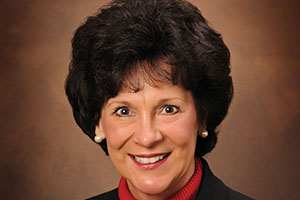
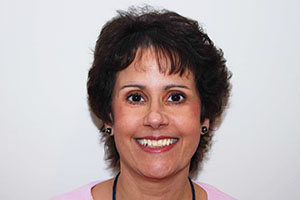

# transformED at the Allegheny Intermediate Unit: A Playground for Teachers

*Watch the video: [transformED at the Allegheny Intermediate Unit on YouTube](https://www.youtube.com/watch?v=Jvc6oDdoDI8)*

*transformED reimagines the look, feel, and purpose of professional development for teachers.*

Traditionally, professional development for educators has been in the form of lectures and presentations in a dimmed auditorium on mandatory in-service days. The sessions can feel perfunctory and not entirely relevant. In a word, they can be boring.

Responding to a call from teachers for more meaningful professional development, the Allegheny Intermediate Unit ([AIU](https://remakelearning.org/organization/aiu/)), a local education service agency, created [transformED](https://remakelearning.org/project/transformed/), and in the process flipped professional development on its head. Through engaging, interactive, and creative sessions, teachers learn innovative instructional practices, explore these new teaching methods, play with new products, software, and tools they might use in their classrooms, and understand curricula. It’s a space where teachers can engage with one another to learn how they might integrate novel teaching approaches into their classroom practice.

“We’re not sitting people in rows. We really want to engage them in a fun, hands-on way,” says [Rosanne Javorsky](https://remakelearning.org/person/javorsky-rosanne/), Assistant Executive Director of Teaching & Learning at the AIU. “It’s OK to make mistakes in here. It’s OK to say, ’Hey, I don’t know how to do this.’ We want teachers to step outside their comfort zone. And we want to help them work through it.”

Without motivated teachers, no technology breakthrough can deeply affect the academic journey of students in school. transformED is the space for teachers to have the kind of professional development experience that ignites passion and curiosity, instead of stifling it.

> How do we create thinkers and learners, not just smart kids? We need a professional development space where teachers can keep pushing education forward.
>
> — Alison Francis, Creativity & Literacy Program Facilitator, Kerr Elementary School

transformED offers teachers opportunities to work with ed-tech tools like [MaKey MaKey](https://remakelearning.org/resource/makey-makey/), [Gigapan](http://www.gigapan.com/), 3-D Printers, and [Hummingbird Robotics Kits](https://remakelearning.org/resource/hummingbird/). Session facilitators are not only professional development consultants; rather they are technologists, scientists, artists, designers, makers, teachers, and even students.

The boundaries between presenters and teachers quickly dissolve during interactive sessions.

“It just happens,” says [Megan Cicconi](https://remakelearning.org/person/cicconi-megan/), AIU’s Director of Instructional Innovation, who works closely with teachers and trainers in transformED. “It’s just a very collaborative space that lends itself to exploratory learning.”

During one workshop on “squishy circuits,” participants took turns playing an interactive video game to cement circuitry principles. Then, they donned aprons and followed a recipe to make two types of Play-Doh: conductive and resistant, and eventually hooked their Play-Doh sculptures up to a battery pack and LED lights. The teachers discussed how students could use the salty, conductive Play-Doh to turn on the LEDs to learn how electricity flows.

Teachers leave transformED sessions more excited to use tech tools in their classrooms, and a community of practice—teachers, technologists, and administrators—to nurture that excitement.

*by Ashlee Green*

## By the Numbers

Teachers participating in transformED sessions come mainly from the 42 Allegheny County school districts as well as some charter schools and private schools.

Depending on the session, transformED can accommodate somewhere between 16 and 30 teachers and administrators. All sessions are currently at capacity.

## Network in Action

**Ideation events generate new ideas for network initiatives. (Convene)**

Innovative professional development was a topic of discussion in the [Remake Learning Network](https://remakelearning.org) years before transformED first launched in February 2013. At Making Sparks 2010, a network event convening members to generate ideas for new projects, at least three discussion groups sketched plans for a “digital playground for teachers.” Recognizing the growing demand among network members, regional funders enthusiastically support AIU’s efforts to turn these ideas into reality with transformED.

**National partnerships connect network members to unique opportunities. (Coordinate)**

AIU uses transformED to host new professional development initiatives in coordination with national organizations like [Common Sense Media](https://remakelearning.org/organization/common-sense-media/), which hosts regular “Appy Hours” in the space for teachers to try the latest in educational software, and the [Institute of Play](https://remakelearning.org/organization/institute-of-play/), which hosts its annual [TeacherQuest](https://remakelearning.org/project/teacherquest/), helps dozens of Pittsburgh teachers design new games and game-like learning experiences.

## Persons of Interest

### Linda Hippert

Linda Hippert is executive director at the Allegheny Intermediate Unit, a local education services agency serving districts in the Pittsburgh region.

> I believe every quality educator wants to do good things in the classroom. Just like your medical doctor has changed in the procedure he or she is using, educators need to do the same thing to address the needs of students for what we call 21st-century skills, and we’re well into that now.

Linda began her career as a high school math teacher and served as a school superintendent for 13 years before assuming leadership of the AIU. As an agency of the Pennsylvania Department of Education, AIU provides support services and professional development for teachers in 42 school districts. In addition to providing support for the most basic needs, Linda has led AIU to become a source of innovation for schools in the region.

Through the STEAM Grants opportunity, AIU has distributed more than $2 million to dozens of schools in the Pittsburgh region to catalyze innovation in classrooms, school libraries, shop classes, art studios, and district offices.

### Rosanne Javorsky

Rosanne Javorsky is Assistant Executive Director for Teaching & Learning at the Allegheny Intermediate Unit.

> There’s so many great things happening, how are you going to discern what will make a difference for students in a classroom? And that’s really where we constantly have this balance. We want the excitement. We want the motivation. We want the student engagement, but ultimately we need those student outcomes.

An educator with over 25 years of experience, Rosanne leads professional development for at the Allegheny Intermediate Unit, a local education services agency that serves more than 40 school districts in the Pittsburgh region. As the Remake Learning Network has evolved and more schools open their doors to innovative uses of technology, there has been a growing demand for teacher professional development that equips educators with the skills and confidence to try new approaches in the classroom.

Rosanne oversaw the design and development transformED, a digital playground for teachers that reimagines professional development as a space for exploration and experimentation for teachers. Rosanne has also overseen the AIU’s annual STEAM Grants funding opportunity to help spur innovative practices in school districts.

## More Information

If you’re interested in learning more about transformED, contact [Megan Cicconi](https://remakelearning.org/person/cicconi-megan/).

### Downloadable Materials

- [**Workshop Instructor Presentation Template**](../docs/downloads/case-studies/transformed/transformEd-Presenter-PP-template.pptx): PowerPoint presentation template highlighting the structure of transformED training sessions.
- [**3D Printing for the Intellectually Curious**](../docs/downloads/case-studies/transformed/3D-printing-for-the-curious.pptx): PowerPoint presentation for a transformED training session introducing the process of using a 3D printer.
- [**Bring It and Bling It**](../docs/downloads/case-studies/transformed/Bring-it-and-Bling-it.pptx): PowerPoint presentation for a transformED training session introducing the process of conductive sewing.

### Online Resources

- [**Center for Creativity**](https://centerforcreativity.net/): transformED’s parent organization; an initiative of The Allegheny Intermediate Unit working to connect creative resources with educators.
- [**Taxonomy for Innovation**](https://hbr.org/2014/01/a-taxonomy-of-innovation/ar/1): Luma Institute’s framework for choosing the best tools in each step of innovative development.
- [**Design Thinking for Educators**](../docs/downloads/case-studies/transformed/Design-thinking-for-educators.pdf): A toolkit for designing new solutions for classrooms, schools, and communities.

### Related Projects & Partners

- [**Project Zero at Quaker Valley**](https://www.qvsd.org/page.cfm?p=6189): A research project designed to study and improve education in the arts.
- [**Teacher Quest**](http://www.instituteofplay.org/work/projects/teacherquest-2/): A teacher training program designed to empower teachers as designers, increase student engagement, and re-imagine teaching through games and game-like learning.
- [**Maker Bootcamp**](https://pittsburghkids.org/education/classes-for-educators): Program offered by the Pittsburgh Children’s Museum to train educators in the skills and knowledge necessary to be a maker.
- [**ASSET**](http://assetinc.org/): An education improvement nonprofit established to advance teaching and learning in science, technology, engineering, and math.
- [**ABC Create**](http://abccreate.weebly.com/): A collaborative dedicated to empowering students and educators in Pennsylvania’s Allegheny-Kiski Valley by encouraging a culture of sharing best practices.

---

*Add your comments and feedback about this case on [Medium](https://medium.com/remake-learning-case-studies/a-playground-for-teachers-964e3b2180b).*
