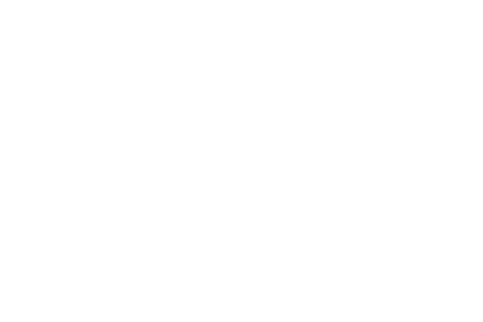

# Convene

*Bring together a diverse cross-section of your community, organize them around a shared vision, and keep them engaged with ongoing opportunities to grow professionally and participate in the creation of a community of practice.*

## Thinking Questions

- **Goals**: What are your overall goals for convening your network?
- **Call to Action**: What is the call to action for convening? Why should people want to convene at all? What will the network offer people that they do not currently have?
- **Challenge & Opportunity**: What challenge or opportunity will bring people together? Does your community have a particular specialty or focus area to rally people around?
- **Current Status**: Are you seeking to formalize a body of professionals already working together informally? Expanding participation by bringing new people into the network? Starting from scratch?
- **Breaking Down Silos**: How will your convening strategies generate opportunities for cross-sector collaboration among the potential network partners you’ve already identified?
- **Lead**: Who will take the overall lead in convening your network?

## Small Groups

Host open and informal meetings for small groups of network members with shared interests to provide ongoing opportunities for network members to meet, share, and collaborate, whether in face-to-face meetups or through online webinars and hangouts.

### Getting Started

- **Choose a topic**: Decide what you will bring people together to speak about—the formation of the network itself or a particular approach to learning that the network can implement.
- **Pick a date, time, and location**: Get the basics of an invitation together by choosing a date 4-6 weeks in the future and securing a meeting space. Even a café or diner can work as a starting point. Also think about how frequent these convenings should be.
- **Create an invite list**: Identify people you want to bring together, being mindful of their interests, availability, and potential contribution to the network. To start, aim for 10-16 invitees, anticipating 8-12 actual attendees.
- **Prep the discussion**: Include a general outline of the meeting agenda with your invitation and encourage participants to add their own discussion items or come with materials to share.
- **Document the meeting**: Ask for a group member to serve as temporary secretary, taking meeting notes and keeping track of what group members are asked to do and what commitments they make.
- **Share out**: Following the meeting, revise and publish your notes, along with any images (drawn or photographed) that illustrate what the group talked about and sharing any specific calls-to-action.

### Examples

- **Meet-ups**: Educators and community members interested in maker learning meet regularly to tour different makerspaces in Pittsburgh, share ideas, and try new techniques, test out new fabrication equipment, and make plans for maker learning projects.
- **Affinity Groups**: Early childhood educators, specialists, and researchers representing both front-line education centers and service agencies, as well as advocacy organizations and research institutions, gather to review current challenges, digest recent research, and work toward a shared agenda for Pittsburgh’s youngest learners.
- **Webinars & Hangouts**: Administrators from Elizabeth Forward School District partner with ed-tech firm Zulama Learning to host monthly Google+ Hangouts on game-based learning, helping to create a community of educators and game designers ready to collaborate.
- **Role-based Roundtables**: The Sprout Fund hosts a quarterly Communications Roundtable for network members who work in marketing, promotions, and public relations at different organizations so that communications professionals can keep each other informed.

## Lunch & Learns

Create opportunities for network members to share their expertise and demonstrate their work for other network members by hosting daytime lunch-and-learn events or evening happy hour gatherings where attendees can learn from one another and consider how they may take advantage of ideas, practices, and upcoming opportunities.

### Getting Started

- **Invite a speaker**: Identify someone from your network or a visitor to your community who has an interesting perspective on learning, a new project or product they’d like to present on, or a conversation they’d like to start.
- **Pick a date, time, and location**: Get the basics of an invitation together by choosing a date 4-6 weeks in the future and securing a meeting space.
- **Order food**: Simple boxed lunches, a selection of wraps, or a build-your-own burrito spread are all affordable options to feed a small group.
- **Advertise**: Get the word out through your newsletter and social media accounts. Ask the venue to add the event to their calendar, and provide the speaker with content to share with his or her professional contacts.
- **Prep the discussion**: Ask the presenter to share a general outline of their presentation in advance and develop some discussion questions you can have ready for the Q & A portion of the lunch and learn.
- **Document & share**: Create a record of the event that you can share with network members who aren’t able to make it. If the event is the first of its kind, consider inviting the press as well.

### Examples

- **Conference Report-Outs**: After a delegation of Pittsburghers returned from the annual Digital Media & Learning conference, they reported on their experience and noted opportunities for the Remake Learning Network at a DML Lunch & Learn.
- **Topic of Interest**: Given the growing interest in 3D printing among both makers and educators, the creators of the Additive Project shared examples of their flexible, open-sourced, project-based curricula for using 3D printing both in school and out-of-school.
- **Upcoming Opportunity**: When The Sprout Fund launched a new funding stream to support Connected Learning projects through its Hive program, Sprout funding programs staffers hosted a Lunch & Learn to help community members develop a functional understanding of Connected Learning.
- **Network Luminary**: In support of his book *Robot Futures*, CREATE Lab director Illah Nourbakhsh presented an exploration of the social challenges created by new technologies and opportunities for Remake Learning to create learning opportunities that meet these pressing challenges.

## Professional Development

Offer professional development sessions and continuing education credits to educators and other professionals seeking to incorporate new and innovative teaching methods into their practice, or partner with established professional development agencies to offer credit at network events and activities so that more educators find valuable professional opportunities at network events.

### Getting Started

- **Find a partner**: Identify a school or support agency in your community who can provide continuing education credits and reach out to them to begin planning.
- **Plan your session**: Work with an innovative educator in your network to develop a workshop session that turns their innovative approach into a training session, or search for such resources on the web.
- **Reach out to educators**: Share information about the session with school administrators and others who can contact educators directly and invite them to participate.
- **Incentivize participation**: If possible, dedicate a small amount of follow-on funding to support educators interested in putting their new knowledge into practice through a pilot project.
- **Document & share**: Work with professional development providers to turn the session into a resource kit you can make available to even more educators.
- **Offer continuing support**: Gather external resources or prepare your own materials for educators to use as an ongoing reference. Keep in touch with educators after they leave the session and support their progress as they implement ideas in their classroom.

### Examples

- **Network Innovators as PD Providers**: The Children’s Innovation Project partner with national PD provider ASSET STEM Education to adapt innovative lessons developed in the classroom into models for interdisciplinary learning other teachers can use.
- **Interest-based PD**: The Children’s Museum of Pittsburgh hosts a Maker Educator Boot Camp, a free professional development workshop for K-12 teachers interested in bringing maker practices into their classrooms.
- **Physical Space**: The Allegheny Intermediate Unit created transformED as a "digital playground" where teachers can work together to develop classroom applications for tech tools like Hummingbird Robotics Kits, e-textiles, 3D printers, and more.
- **Offer Credits at Network Events**: The Sprout Fund partnered with PAEYC, an agency that can issue professional development credits, to offer credits to educators participating in the Pittsburgh Learning Pathways Summit, making the event even more worthwhile to teachers.

## Network Engagement Events

Invite all network members to gather for important occasional events where members can establish relationships, focus their attention on issues and opportunities of critical importance, collaborate directly in facilitated discussions, reflect on past accomplishments and look ahead to potential future opportunities.

### Getting Started

- **Set your goals for the event**: Identify your audience and determine what you want them to learn and/or do as a result of participating in the event. This will guide the rest of your decisions. Keep the goals few and simple.
- **Pick a date, time, and location**: Get the basics of an invitation together by choosing a date 12-16 weeks in the future and securing a meeting space.
- **Plan the program & build a budget**: Decide the format of your event, sketch out a floor plan, draft a basic agenda, and create a run-of-show. Tabulate your anticipated expenses for the venue rental, food and refreshments, event logistics, and any speaker or programming costs.
- **Save the date**: Once you’ve confirmed the basics, send a save the date no more than 10 weeks in advance. Send a real invitation with registration details at least 6 weeks prior to the event.
- **Facilitate new ideas**: Use discussion techniques like human-centered design to engage event participants in productive conversations. Start with a topic, theme, or challenge, and guide them through collaborative activities that generate new ideas.
- **Document & share**: Create a record of the event that you can share with network members who aren’t able to make it. If the event is the first of its kind, consider inviting the press as well.

### Examples

- **Making Sparks**: To generate new ideas for innovative learning projects, The Sprout Fund hosted Making Sparks, an event that facilitated collaborative brainstorming among educators and innovators, and tied real funding resources to the outcome.
- **Pittsburgh Learning Pathways Summit**: The Pittsburgh Learning Pathways Summit brought together educators and students from more than 30 regional school districts to take a leading role in the ongoing development of digital badges for learning through the Remake Learning Network.
- **CONTEXT**: The CREATE Lab at Carnegie Mellon hosted CONTEXT, a conference focusing on how educators implement technology in practical ways in their classrooms and out-of-school learning environments.
- **Network Primer**: Shortly after the Remake Learning Network first formalized, Carnegie Mellon University hosted a day-long event that threw the doors open to the previously small and informal network, attracting more than 500 educators and innovators.

## Annual Conferences

Host or partner on annual events for specific groups of network members such as education technology conferences for entrepreneurs and commercial partners, academic summits for researchers and scholars, and professional development events for out-of-school educators or early childhood education specialists.

### Getting Started

- **Set your goals for the event**: Identify your audience and determine what you want them to learn and/or do as a result of participating in the event. This will guide the rest of your decisions. Keep the goals few and simple.
- **Pick a date, time, and location**: Get the basics of an invitation together by choosing a date at least six months in the future and securing a meeting space.
- **Invite participants**: Identify speakers and exhibitors, invite them to participate, and find out their technical, space, and media needs.
- **Plan the program & build a budget**: Decide the format of your event, sketch out a floor plan, draft a basic agenda, and create a run-of-show. Tabulate your anticipated expenses for the venue rental, food and refreshments, event logistics, and any speaker or programming costs.
- **Save the date**: Once you’ve confirmed the basics, send a save the date no more than 16 weeks in advance. Send a real invitation with registration details at least 12 weeks prior to the event.
- **Document & share**: Create a record of the event that you can share with network members who aren’t able to make it. If the event is the first of its kind, consider inviting the press as well.

### Examples

- **TRETC**: The Pittsburgh Technology Council hosts the Three Rivers Education Technology Conference to connect ed-tech entrepreneurs and enterprise-scale with administrators and educators from regional school districts to scope out the latest in ed-tech gear.
- **FredForward**: The Fred Rogers Center for Early Learning and Children’s Media invites thought leaders, researchers, and producers of children’s media from all over the world to visit Pittsburgh for an agenda-setting conference at the intersection of education and entertainment.
- **PAEYC Conference & UnConference**: The Pittsburgh Association for the Education of Young Children hosts an alternating Conference & UnConfernece event each year, giving Pittsburgh-area early childhood educators an opportunity to hear from national leaders at the conference, while working together as peers at the UnConference.
- **CREate Festival**: Celebrating the intersection of creativity and technology, the CREate Festival is part showcase, part trade show, and part innovation summit with an entire track of programming dedicated to highlight innovations led by the Remake Learning Network.

## External Speakers

Invite thought leaders to visit your community and speak to network members as a means of importing knowledge and creating opportunities for partnership and collaboration with other regions also working to remake learning.

### Getting Started

- **Set your goals for the event**: Identify your audience and determine what you want them to learn and how they will use this new knowledge in their practice. This will guide the rest of your decisions. Keep the goals few and simple.
- **Invite and secure a speaker**: Survey the national landscape of writers, speakers, and leaders you pay attention to and can get in touch with. Find the speaker’s appropriate contact, which might be a speakers’ bureau or manager, and reach out with a formal invitation to speak to your network.
- **Secure a venue**: Based on the dates of your speaker’s availability and intended audience, rent or borrow a venue that will accommodate your anticipated attendance and provide the requisite audio-visual capabilities to meet the speaker’s needs.
- **Save the date**: Once you’ve confirmed the basics, send a save the date no more than 10 weeks in advance. Send a real invitation with registration details at least 6 weeks prior to the event.
- **Document & share**: Create a record of the event that you can share with network members who aren’t able to make it. If the event is the first of its kind, consider inviting the press as well.

### Examples

- **Tours & Roadshows**: As part of its Together for Tomorrow initiative to strengthen partnerships among schools, families, and communities, the U.S. Department of Education visited Pittsburgh to tour Remake Learning network sites and speak with members at a listening session.
- **Authors & Thinkers**: The Fred Rogers Center, leveraging its position as a recognized leader in early childhood education, invited author Paul Tough to speak at Saint Vincent College near Pittsburgh and read from selections of his book *How Children Succeed*.
- **National Partners**: As part of its ongoing efforts to build an ecosystem for digital badges in Pittsburgh, The Sprout Fund brought Akili Lee of the Digital Youth Network to Pittsburgh to speak about DYN’s experience deploying digital badges in Chicago.
- **Launch Events**: At the launch event for Pittsburgh City of Learning, major new initiative involving dozens of Remake Learning Network members, speakers from the MacArthur Foundation and the Badge Alliance gave remarks to reinforce how Pittsburgh connected to national efforts.
